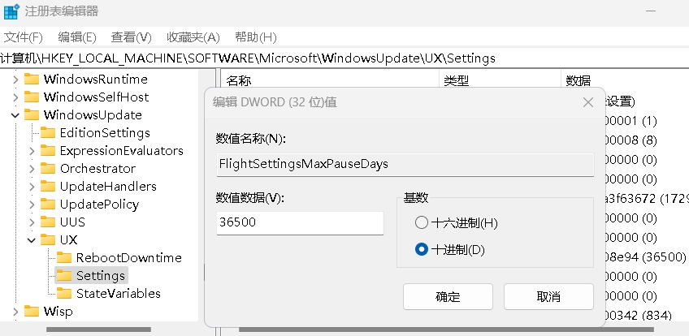

废话不多说，直接上教程。

WIN+R 输入 regedit 进入注册表编辑器。

> 按照以下顺序依次点击:
```
计算机\HKEY_LOCAL_MACHINE\SOFTWARE\Microsoft\WindowsUpdate\UX\Settings
```

右边空白处，右击新建一个 DWORD值

重命名为: 
```
FlightSettingsMaxPauseDays
```

双击 FlightSettingsMaxPauseDays ，基数选择十进制。

左侧填写为你想暂停的整数天数，例如36500天，点确定。


然后 WIN+i 打开系统设置，在Windows更新里就可以选择设置好的最长周期时长。

如果想更新的话，点击继续更新就可以了。
